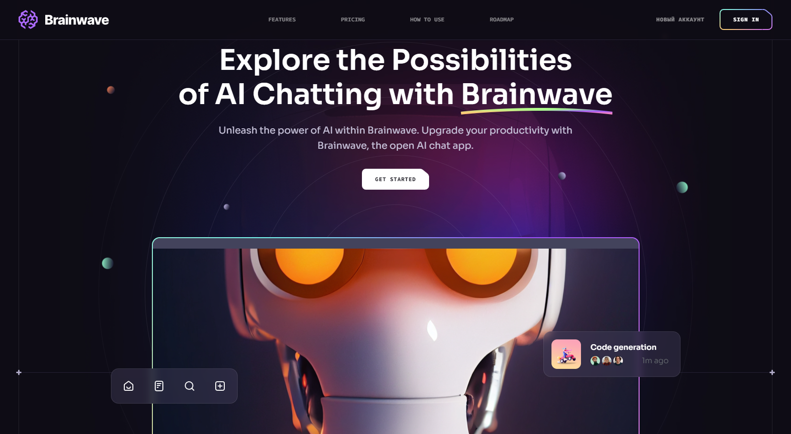
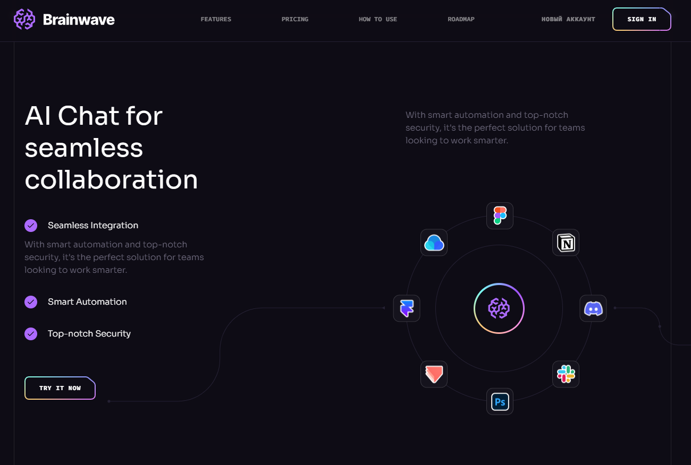
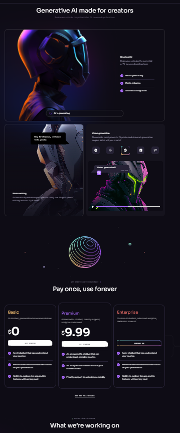
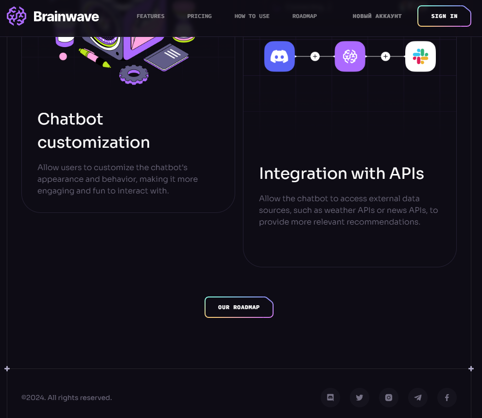

# Modern UI/UX website

 

Learn to create modern websites with sleek parallax effects and bento box layouts. This course covers everything from stylish UI design to mobile-first principles while strengthening your React.js and Tailwind CSS skills

